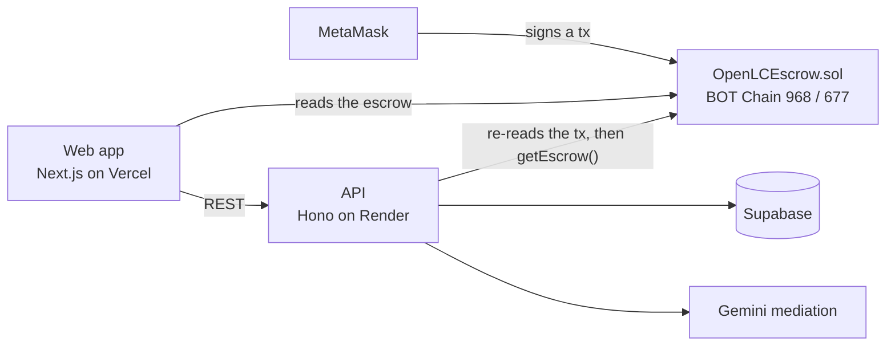

# OpenLC — the open letter of credit

Escrow for B2B orders on BOT Chain: the buyer's payment is locked before the goods ship, paid out in
milestones as dispatch and delivery are proven, and when part of a delivery goes wrong only the
disputed amount is held while everything else pays the supplier in the same transaction.

**Live app:** https://openlc.vercel.app · **API:** https://openlc-api.onrender.com (`/health`) ·
**Repo:** https://github.com/zghanw/openlc

## The problem

Across Asia, 44% of B2B sales made on credit are paid late and about 5% are never paid at all
([Atradius Payment Practices Barometer, Asia 2025](https://group.atradius.com/dam/jcr:de5379ba-2ad5-415f-9c77-6e6c2669d13e/payment-practices-barometer-asia-2025-en.pdf));
the bank instrument that fixes this, trade finance, turns down 41% of SME applications
([ADB Global Trade Finance Gap Survey, Dec 2025](https://www.tralac.org/documents/news/7229-adb-global-trade-finance-gap-survey-december-2025/file.html)).
Every order shipped on 60-day credit is the supplier lending to a stranger.

OpenLC replaces credit terms and deposits with payment secured before dispatch and released on proof.

## How it works

An order becomes an escrow the moment the buyer funds it: the whole payment moves into
`OpenLCEscrow.sol` on BOT Chain in one transaction. From there it pays out in the stages the two
parties agreed to:

1. **Funding** — the buyer locks the full order value; the agreed deposit percentage pays the
   supplier immediately.
2. **Shipment** — the supplier marks the order shipped with a dispatch evidence hash; the dispatch
   milestone pays out.
3. **Delivery** — the buyer accepts (the rest pays the supplier) or opens a claim on part of it.
   Opening a claim holds only the disputed amount; the rest of what's left pays the supplier
   **in the same transaction**.
4. **Settlement** — the disputed amount pays out once both parties sign the identical split, or
   the arbitrator signs one.
5. **Deadlines** — if the supplier never ships, the buyer can reclaim the escrow once the delivery
   deadline passes. If the buyer never responds after shipment, the supplier can claim it once the
   inspection window closes.

A real example from BOT Chain testnet (order PO-97139111, a 1 BOT order): the buyer opened a claim
on 0.15 BOT of a 0.7 BOT delivery balance. The same transaction paid the supplier the undisputed
0.55 BOT. Both parties then signed the same split, and executing it refunded the buyer the full
0.15 BOT they'd disputed. One order, one dispute, no frozen invoice for the part that wasn't in
question. See [On-chain activity](#deployment) below for the transaction hashes.

## Try it

### One wallet (fastest)

1. Open https://openlc.vercel.app, connect MetaMask, and sign the one-time sign-in message. If
   your wallet is on another network, a banner offers "Switch to BOT Chain Testnet"; the app also
   asks MetaMask to switch to it (adding it first if needed) before your first transaction.
2. Get testnet BOT from the faucet: https://faucet.botchain.ai/basic
3. Create an order and tick **"Use the OpenLC demo supplier."** It defaults to a 0% deposit / 0%
   dispatch / 100% on delivery release plan, and the order is confirmed in the same request — no
   second wallet needed yet.
4. Click **Fund escrow** and sign the one transaction that locks the BOT. The order page's
   **"On BOT Chain"** panel reads the locked balance straight from the contract.
5. The demo supplier never ships. Once the delivery deadline passes (never less than 24 hours
   after funding), click **Reclaim the escrow** to get the full amount back.

### Two wallets (the full flow)

1. A second MetaMask account opens the confirmation link and accepts — it becomes the supplier
   and its payout address.
2. The buyer funds the escrow.
3. The supplier marks shipment with a dispatch photo. Its SHA-256 is written on chain, and the
   dispatch payment releases.
4. The buyer either accepts delivery (releases the rest) or opens a claim on part of it — one
   transaction holds only the disputed amount and pays the rest to the supplier.
5. The parties negotiate directly, or ask the AI mediator: Gemini plays a buyer advocate, a
   supplier advocate, and a neutral mediator. Every quote it makes is checked word for word
   against the dispute policy and the submitted evidence. The AI cannot move money.
6. Once both sides accept a split, each signs it on chain, and either party (or anyone) executes
   it to pay out.

## Deployment

| Network | Chain ID | Contract address | Explorer | Verified | Deploy block / tx |
|---|---|---|---|---|---|
| BOT Chain Testnet | 968 | [`0x20C3b91B78D6F86b27C01e12692d2e56C0bcA5C5`](https://scan.bohr.life/address/0x20C3b91B78D6F86b27C01e12692d2e56C0bcA5C5) | [scan.bohr.life](https://scan.bohr.life/address/0x20C3b91B78D6F86b27C01e12692d2e56C0bcA5C5) | Yes (solc 0.8.24, optimizer 200) | block 24026875 / [deploy tx](https://scan.bohr.life/tx/0x1349fb2c495b230df17f4bb70e5ec623d39a9fd8845c567b3e2b34a7e267d21a) |
| BOT Chain Mainnet | 677 | Pending: deploys on launch day | [scan.botchain.ai](https://scan.botchain.ai) | — | — |

Deploy record: [`deployments/botchain-testnet.json`](deployments/botchain-testnet.json). Gas on
BOT Chain runs around 20 gwei; a single escrow action (fund, ship, claim, settle) costs about
0.002–0.004 BOT.

**On-chain activity** (testnet, [scan.bohr.life](https://scan.bohr.life)):

- **PO-90758439** (3 BOT, happy path — 10% deposit / 20% dispatch / 70% on delivery):
  [fund + 0.3 BOT deposit](https://scan.bohr.life/tx/0x846ea2b8874fa2bfdfa2c36ef42b0801b65504a8127014fe9de49b257da6c46f) ·
  [ship + 0.6 BOT dispatch](https://scan.bohr.life/tx/0x2098aacdbe5ff33d5d971b906e55ff5798cd3a092ada5a11d1099b072bd29005) ·
  [full acceptance releasing 2.1 BOT](https://scan.bohr.life/tx/0x793669d83aa0a3e0ca5a78ec8c6c8d0aa495ed40bed455328f0c3584bada57ed)
- **PO-97139111** (1 BOT, the partial-claim headline above):
  [fund + 0.1 BOT deposit](https://scan.bohr.life/tx/0x8f215a07dbe962e31b5ce86070a17c05a3c4b5d5b22bee6c39c1bb1bcdc0b33b) ·
  [ship + 0.2 BOT dispatch](https://scan.bohr.life/tx/0xd8bff88315199b0a36b16c9c7b361ad0eeded6775668aed130ac4d60bb4746af) ·
  [damage photo anchored](https://scan.bohr.life/tx/0x2f4631e0741b19cd99004ab3b82b7bbc12a301ecce0c35f88c75923499c220eb) ·
  [claim opens, 0.55 BOT paid to the supplier in the same tx](https://scan.bohr.life/tx/0x8a72ab5e9f79100ee522063024443288a8bba20f23c634aa2a78667c6060f97a) ·
  [buyer approves the split](https://scan.bohr.life/tx/0x456a3a260b1cfb44a35100aa08c0d5024cd83a6818ccbdaa0696a109b7f518a2) ·
  [supplier approves the same split](https://scan.bohr.life/tx/0x0b83f4cd77cd363bcab2ee6ba35483b033bd12e168bb7c935642b1bee0c2f765) ·
  [settlement executed, 0.15 BOT refunded to the buyer](https://scan.bohr.life/tx/0xb57dc85208eee87e171db06dbcecc370ad310d382c9af0101ae014d6fe220e61)
- **DEMO-DEADLINE-79452557** (escrow #3, 0.01 BOT, a 150-second delivery deadline, proving the
  buyer's deadline reclaim): [fund](https://scan.bohr.life/tx/0x0f9b65e2737c099c4fa374f165dd2b9bb6deb393bbac8c460a168cb00f550646) ·
  [reclaimed with refundUnshipped() after the deadline passed](https://scan.bohr.life/tx/0xed3f2817831236bf4cb8df7502868149495a05bd293d1ef1235e12d31c246344)

## Architecture



The web app talks to MetaMask for every money movement and to the API for the business record —
orders, invites, documents, disputes, and mediation. The contract is the source of truth for
funds; the API and the order page both read it directly rather than trusting a cached copy.

## Security model

- The API never signs a transaction and never holds funds or private keys.
- After every wallet transaction, the browser posts the transaction hash, and the API re-reads
  that transaction from BOT Chain before marking the step `verified_on_chain` — checking the
  receipt succeeded, the event came from the configured escrow contract, the event fields match
  the order, and `tx.from` is the wallet that was supposed to sign it.
- The order page also reads the escrow straight from the contract, so a stale or wrong API record
  can't hide what's actually locked on chain.
- The contract itself has no owner, no admin role, no upgrade path, and charges no fee.
- OpenLC appoints the arbitrator for every order during the pilot: the platform's own wallet,
  `0x1221C500Dfd0D3E477ed741a849edEa303d689Ca` (also the contract deployer). This is disclosed in
  the [Terms of Service](docs/terms-of-service.md). The arbitrator can settle only the disputed
  amount, and only within the refund the buyer originally requested — the contract enforces both
  limits, not just the policy.

## Limitations

This is a pilot, not a finished product:

- One platform-appointed arbitrator; nominating your own arbitrator isn't available yet.
- AI mediation depends on Google Gemini's capacity. During an outage it abstains ("busy, try
  again") instead of guessing; `GEMINI_MODEL` is an ordered fallback list of models to try.
- Legal statute/case-law retrieval (Qdrant) is off in production; mediation still runs without it,
  but the human arbitration package has no cited authorities.
- Native BOT only — no other tokens.
- The delivery deadline floor is 24 hours; it can't be set shorter than that.
- The BOT Chain testnet RPC occasionally returns 503 for a few minutes at a time.
- The backend still stores a few field names carried over from how this project began (see
  Origin below): `packageId` names the contract address, `escrowObjectId` names the escrow id, and
  `transactionDigest` names a transaction hash. They're internal field names, not user-visible.

## The contract

[`contracts/OpenLCEscrow.sol`](contracts/OpenLCEscrow.sol) — no owner, no admin, no upgrade path,
no fee. Tests: [`test/OpenLCEscrow.test.js`](test/OpenLCEscrow.test.js).

| Function | Caller | What it does |
|---|---|---|
| `createEscrow(supplier, arbitrator, orderHash, orderReference, deposit, dispatch, delivery, deliveryDeadline, inspectionWindow)` | buyer | Locks the full payment in a new escrow and pays the deposit to the supplier immediately. |
| `markShipped(id, evidenceHash)` | supplier | Records a dispatch evidence fingerprint and pays the dispatch milestone. |
| `anchorEvidence(id, kind, evidenceHash)` | buyer or supplier | Binds a document fingerprint to the escrow as an event; no funds move. |
| `openDispute(id, disputedAmount, requestedBuyerRefund)` | buyer | Holds only the disputed amount and pays the rest of the balance to the supplier, same transaction. |
| `approveSettlement(id, buyerRefund, supplierRelease, proposalHash)` | buyer, supplier, or arbitrator | Signs one exact split of the disputed amount; the arbitrator's approval always overrides. |
| `executeSettlement(id)` | anyone | Pays out a split once both parties, or the arbitrator, have approved it. |
| `releaseFull(id)` | buyer | Releases the whole remaining balance to the supplier without a dispute. |
| `refundUnshipped(id)` | buyer | Refunds the whole balance once the delivery deadline has passed and nothing shipped. |
| `claimUninspected(id)` | supplier | Pays the supplier the whole balance once the inspection window has closed with no buyer action. |
| `withdraw()` | anyone owed a payout | Claims a payout that a capped-gas push couldn't deliver, instead of blocking the sender. |
| `getEscrow(id)`, `inspectionClosesAt(id)`, `escrowCount`, `owed(address)` | anyone | Read-only views. |

Invariant, checked in the test suite: for every escrow, the total funded always equals what's
been released, plus what's still held, plus what's been refunded.

## Run it locally

**Prerequisites:** Node.js 22+, npm, and (for chain actions) a MetaMask wallet holding testnet BOT
from the faucet.

**Environment variables** — names only, see the `.env.example` files for the full list:

- [`/.env.example`](.env.example) — the Hardhat deployer key, and every backend variable
  (`BOTCHAIN_RPC_URL`, `OPENLC_ESCROW_ADDRESS`, `SUPABASE_*`, `GEMINI_*`, `OPENLC_SESSION_SECRET`,
  and more).
- [`web/.env.example`](web/.env.example) — `NEXT_PUBLIC_OPENLC_BACKEND_URL`,
  `NEXT_PUBLIC_BOTCHAIN_CHAIN_ID`, `NEXT_PUBLIC_OPENLC_ESCROW_ADDRESS`,
  `NEXT_PUBLIC_OPENLC_ESCROW_DEPLOY_BLOCK`, `NEXT_PUBLIC_OPENLC_ARBITRATOR_ADDRESS`, `GEMINI_API_KEY`,
  `GEMINI_MODEL` (used by the Import-from-file purchase-order reader), and more.

See [`backend/README.md`](backend/README.md) for which backend variables are optional.

**Commands:**

```bash
# contracts (repo root)
npm ci
npm test              # 41 passing
npm run compile
npm run deploy:testnet   # writes deployments/botchain-testnet.json

# backend
cd backend && npm ci
npm run dev           # or: npm start
npm test              # 144 passing

# web
cd web && npm ci
npm run dev
npm run build
```

## Repo layout

```text
/                 Hardhat project root: hardhat.config.js, package.json, contracts, test, scripts
contracts/        OpenLCEscrow.sol, plus two test-only hostile-receiver contracts
test/             OpenLCEscrow.test.js
scripts/          deploy.js (writes deployments/<network>.json), export-abi.js
deployments/      committed: address, deploy block, deploy tx, chain id per network
backend/          the API — see backend/README.md
web/              the Next.js web app
docs/             terms of service, dispute policy, demo assets
supabase/         database migrations
sources/          local-only reference material (gitignored, not part of this repository)
```

## Origin: OpenLC is a BOT Chain rebuild of the team's own PayProof prototype

OpenLC is not a copy of someone else's project. It's the team's own prior prototype, PayProof —
built on Sui, with Move contracts, Google zkLogin sign-in, and USDC/SUI settlement — rebuilt on
BOT Chain for this hackathon. What changed, concretely:

- The Move escrow was rewritten in Solidity as `OpenLCEscrow.sol`, with EVM-specific adaptations
  (native BOT via `msg.value`, a capped-gas push with a pull-based `withdraw()` fallback so a
  hostile recipient can't block a dispute) and a 41-test suite covering parity with the Move
  version plus reentrancy, hostile-receiver, and deadline-boundary cases the original didn't need.
- MetaMask EIP-191 sign-in replaces Google zkLogin and Enoki sponsored gas.
- EVM verifiers re-read every step from BOT Chain and replace the old Sui verifiers — stronger in
  one respect: they pin each step to `tx.from`, the wallet that actually signed it.
- Wallet-bound invite links replace email invitations.
- Native BOT replaces USDC/SUI settlement.
- The one-wallet demo supplier, the chain-then-record recovery that stops a step from being
  stranded between a signed transaction and a saved record, and the chain-truth order page are
  new for this build.
- A settlement-verification bug inherited from the original Sui version was found and fixed during
  the port (it compared the wrong escrow amount, so no order that released a deposit or dispatch
  payment before a dispute could ever have its settlement recorded).

What carried over unchanged: the business model, the dispute-resolution workflow and AI mediation
design, and the web app's overall structure.

## License

MIT, per [`package.json`](package.json).
