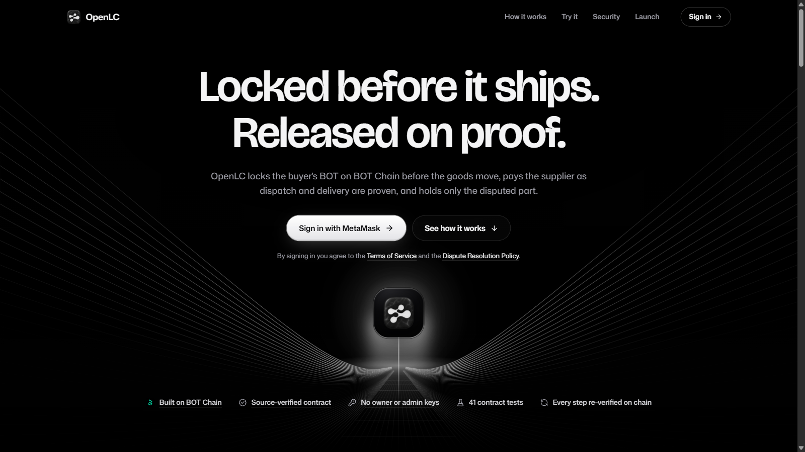
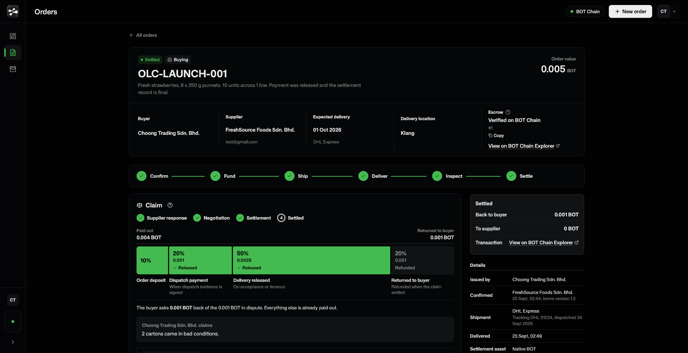
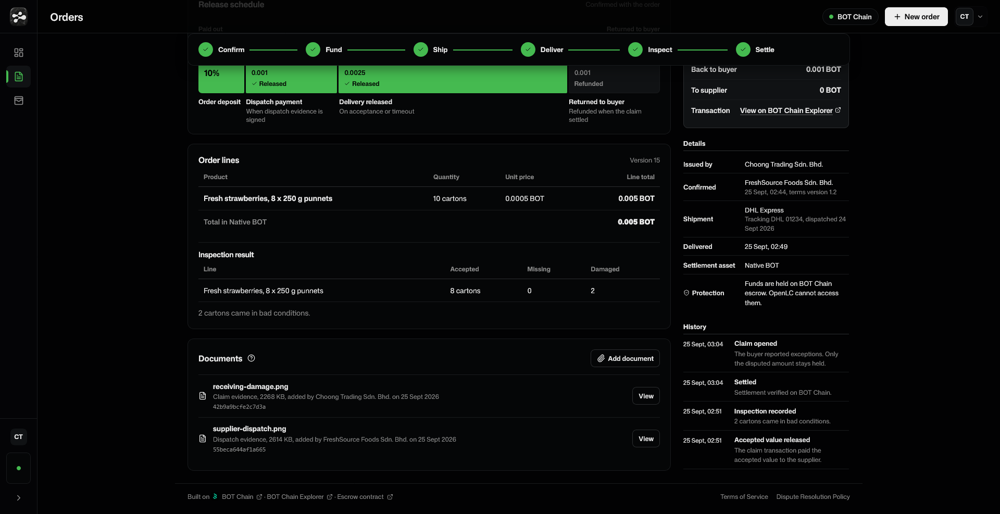
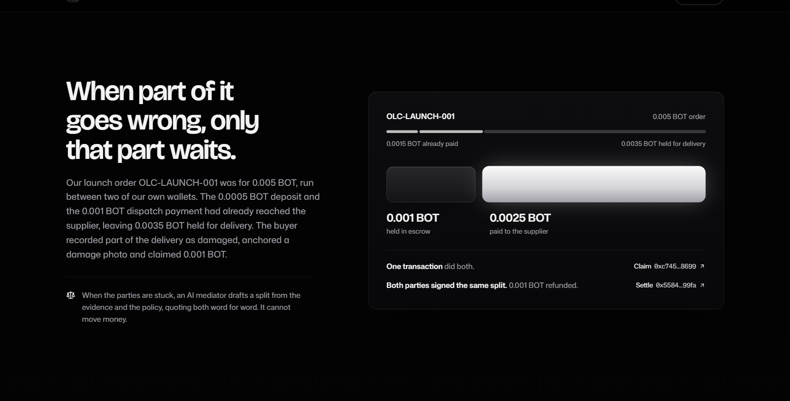
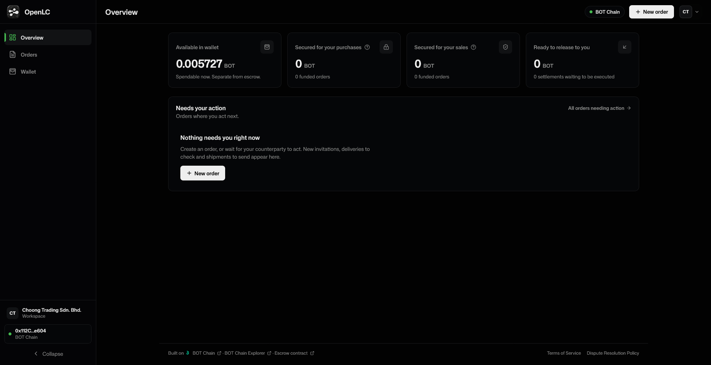
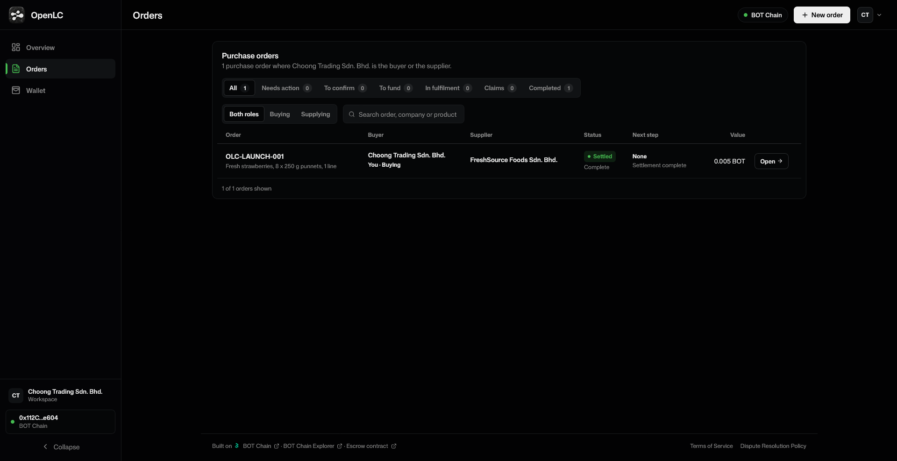
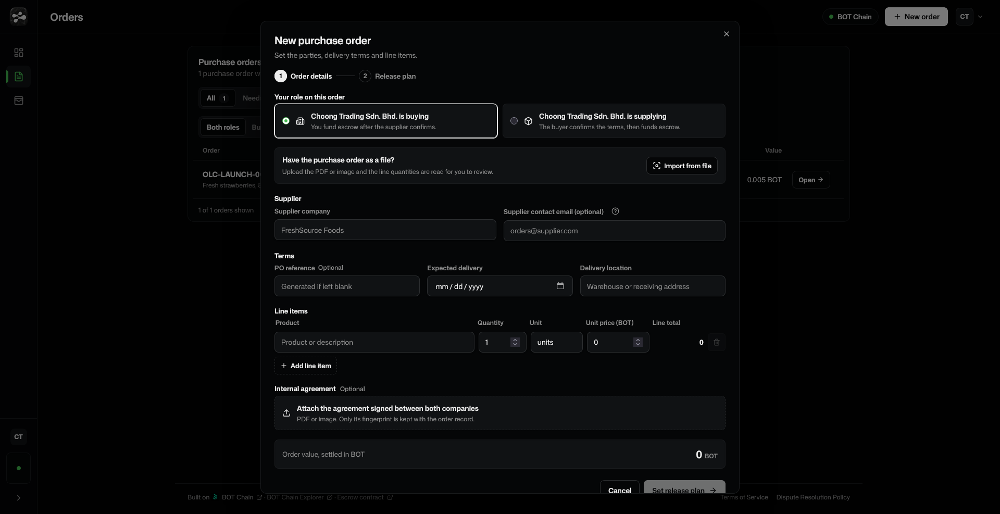
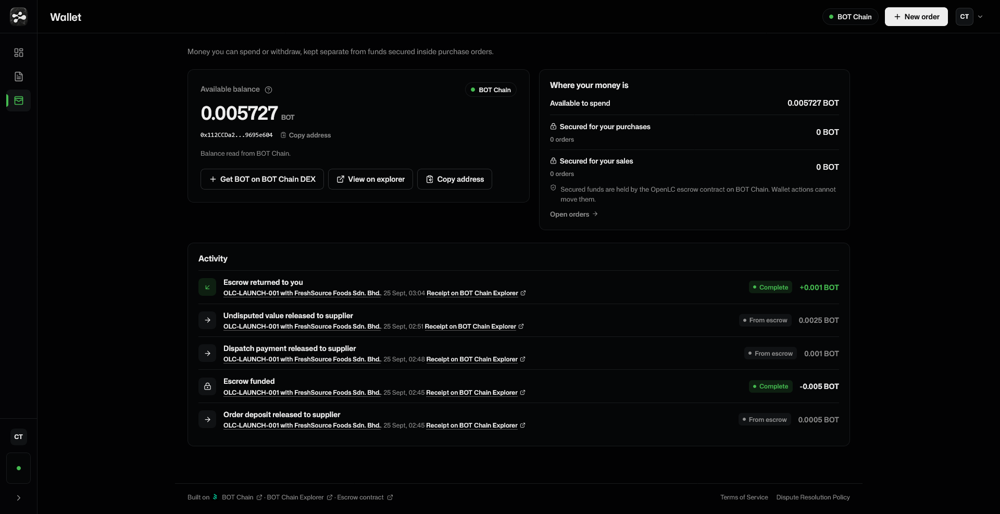
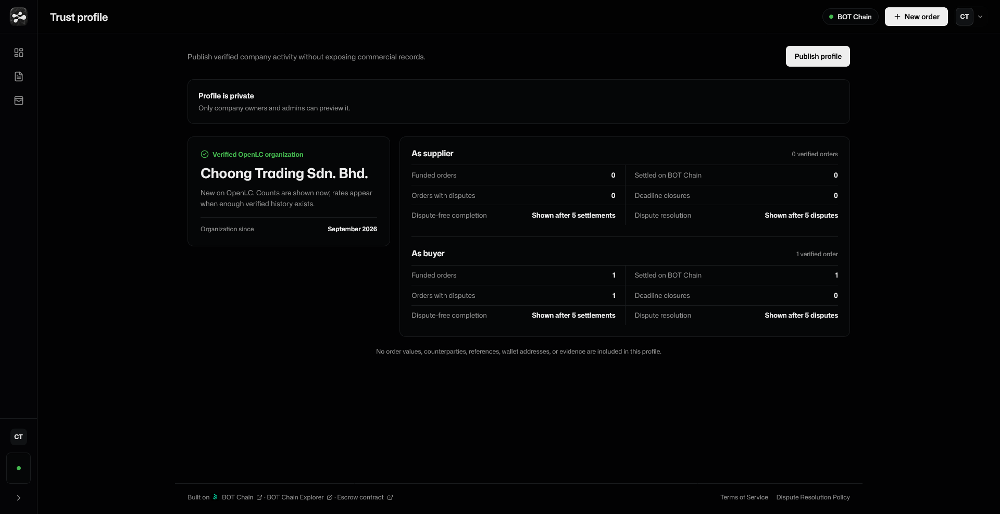
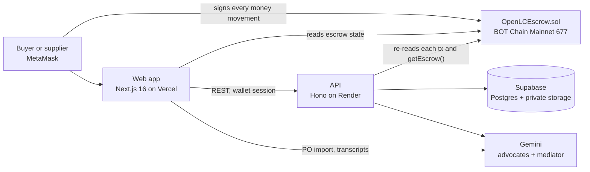

<div align="center">
  
  <br><br>
  <h1>OpenLC</h1>
  <p><strong>The open letter of credit: escrow for B2B orders on BOT Chain. Payment is locked before the goods ship, released on proof, and when part of a delivery goes wrong, only that part waits.</strong></p>
  <p>
    <a href="https://openlc.online"><strong>Live App</strong></a>
    &nbsp;|&nbsp;
    <a href="https://scan.botchain.ai/address/0xd35bbde52618F716597cb097Fab3E52D3605A7c6#code"><strong>Verified Mainnet Contract</strong></a>
    &nbsp;|&nbsp;
    <a href="https://openlc.online/launch"><strong>Mainnet Launch</strong></a>
    &nbsp;|&nbsp;
    <a href="https://x.com/OpenLCdev/status/2103245338459193723"><strong>Video Walkthrough</strong></a>
    &nbsp;|&nbsp;
    <a href="contracts/OpenLCEscrow.sol"><strong>Source</strong></a>
    &nbsp;|&nbsp;
    <a href="RESEARCH.md"><strong>Research Report</strong></a>
    &nbsp;|&nbsp;
    <a href="https://x.com/OpenLCdev"><strong>@OpenLCdev</strong></a>
  </p>
  <p>
    <a href="https://soliditylang.org/"></a>
    <a href="https://hardhat.org/"></a>
    <a href="https://nextjs.org/"></a>
    <a href="https://react.dev/"></a>
    <a href="https://www.typescriptlang.org/"></a>
    <a href="https://docs.ethers.org/v6/"></a>
    <a href="https://hono.dev/"></a>
    <a href="https://supabase.com/"></a>
    <a href="https://ai.google.dev/"></a>
    <a href="https://scan.botchain.ai/"></a>
    <a href="LICENSE"></a>
  </p>
</div>



| Verified mainnet contract | Tested at every layer | Chain-verified backend | AI that cannot move money |
|---|---|---|---|
| [`OpenLCEscrow`](https://scan.botchain.ai/address/0xd35bbde52618F716597cb097Fab3E52D3605A7c6#code) is deployed and source-verified on BOT Chain Mainnet. No owner, no admin key, no upgrade path, no fee. | [41 contract tests](test/OpenLCEscrow.test.js), 143 API tests and exact-money checks in the web app. | The API re-reads every transaction from BOT Chain before it records a step, and pins it to the wallet that signed it. | Gemini advocates and a neutral mediator propose splits that quote the policy word for word. Only the parties' signatures move BOT. |

A supplier who ships on 60-day credit is lending money to a stranger. OpenLC replaces credit terms and deposits with payment that is secured before dispatch and released on proof. The buyer locks the full order value in a BOT Chain escrow with one signature. The supplier is paid in milestones as it proves dispatch and delivery. If part of a delivery is damaged or missing, one transaction holds only the disputed amount and pays the supplier everything else, so a disagreement over two cartons never freezes the whole invoice.

**Deployment status:** OpenLC is live on **BOT Chain Mainnet** (chain ID `677`) at [`0xd35bbde52618F716597cb097Fab3E52D3605A7c6`](https://scan.botchain.ai/address/0xd35bbde52618F716597cb097Fab3E52D3605A7c6#code), and the live app at [openlc.online](https://openlc.online) talks only to that contract. The app fails closed when the network or contract is not configured, so it can never sign against the wrong chain or a retired address. The same source ran full order cycles on BOT Chain Testnet first, and the [first mainnet order](#first-mainnet-order-olc-launch-001) exercised every money path with real BOT.

## Deployment

| Network | Chain ID | Contract | Verified | Deploy block | Deploy transaction |
|---|---|---|---|---|---|
| BOT Chain Mainnet | `677` | [`0xd35bbde52618F716597cb097Fab3E52D3605A7c6`](https://scan.botchain.ai/address/0xd35bbde52618F716597cb097Fab3E52D3605A7c6#code) | Yes, [scan.botchain.ai](https://scan.botchain.ai/address/0xd35bbde52618F716597cb097Fab3E52D3605A7c6#code) | `24383220` | [`0x0f80fbd0...57f7a7`](https://scan.botchain.ai/tx/0x0f80fbd027c4fa8e48921f649afe42649ce944f71c7f903d9e76e2fa8857f7a7) |
| BOT Chain Testnet | `968` | [`0x20C3b91B78D6F86b27C01e12692d2e56C0bcA5C5`](https://scan.bohr.life/address/0x20C3b91B78D6F86b27C01e12692d2e56C0bcA5C5) | Yes, [scan.bohr.life](https://scan.bohr.life/address/0x20C3b91B78D6F86b27C01e12692d2e56C0bcA5C5) | `24026875` | [`0x1349fb2c...67d21a`](https://scan.bohr.life/tx/0x1349fb2c495b230df17f4bb70e5ec623d39a9fd8845c567b3e2b34a7e267d21a) |

**Mainnet deployment record** ([`deployments/botchain-mainnet.json`](deployments/botchain-mainnet.json)):

| Field | Value |
|---|---|
| Contract address | [`0xd35bbde52618F716597cb097Fab3E52D3605A7c6`](https://scan.botchain.ai/address/0xd35bbde52618F716597cb097Fab3E52D3605A7c6#code) |
| Network | BOT Chain Mainnet (chain ID `677`) |
| Deployed by | `0x1221C500Dfd0D3E477ed741a849edEa303d689Ca` |
| Deployment transaction | [`0x0f80fbd027c4fa8e48921f649afe42649ce944f71c7f903d9e76e2fa8857f7a7`](https://scan.botchain.ai/tx/0x0f80fbd027c4fa8e48921f649afe42649ce944f71c7f903d9e76e2fa8857f7a7) |
| Deployment block | `24383220` |
| Deployment date | `2026-09-25` |
| Deployment cost | 1,540,006 gas at 20 gwei, `0.0308 BOT` |
| Compiler | Solidity `0.8.24`, optimizer 200 runs, `viaIR` |
| Web app | [openlc.online](https://openlc.online) on Vercel |
| API | `https://openlc-api.onrender.com` on Render ([`/health`](https://openlc-api.onrender.com/health)) |

Launch announcement: [OpenLC is officially launched on BOT Chain Mainnet](https://openlc.online/launch). Video walkthrough: [a four-part thread on X](https://x.com/OpenLCdev/status/2103245338459193723), each part posted as a reply to the one before.

## First mainnet order: OLC-LAUNCH-001

We ran the first mainnet order ourselves, between two of our own wallets, to prove every money path with real BOT: a 0.005 BOT order with a 10 / 20 / 70 release plan (deposit, dispatch, delivery), a damage claim on part of the delivery, and a split signed by both parties.

| Order page | Order record |
|---|---|
|  |  |
| Every stage is complete. The release bar shows what reached the supplier (0.004 BOT) and what went back to the buyer (0.001 BOT). | Order lines, the inspection result, both anchored documents with their SHA-256 fingerprints, and the order history. |

| Mainnet partial claim on the landing page |
|---|
|  |
| The public landing page tells the same order with links to each transaction on the BOT Chain Explorer. |

### On-chain receipts

Escrow `#1` on the mainnet contract, all sent through [openlc.online](https://openlc.online):

| Step | What moved | Mainnet proof |
|---|---|---|
| Fund | Buyer locks `0.005 BOT`; the `0.0005 BOT` deposit pays the supplier in the same transaction | [`0xc7fa38a1...1f9e65`](https://scan.botchain.ai/tx/0xc7fa38a1e989b272612ea609502e10fabe652cbab0e156028d6beadacc1f9e65) |
| Ship | Supplier anchors the dispatch photo's SHA-256; `0.001 BOT` dispatch payment released | [`0x1b3d40c8...29cdee`](https://scan.botchain.ai/tx/0x1b3d40c8894ad1b5ae51f81d810c7fbe0ec17217714d986ce0637c2f6e29cdee) |
| Anchor damage photo | Buyer anchors the damage photo's SHA-256; no funds move | [`0xdb664805...fbda1799`](https://scan.botchain.ai/tx/0xdb6648058342f49fc45d860e11d9baa37870192fdcf409fb49d37983fbda1799) |
| **Partial claim** | **One transaction holds the disputed `0.001 BOT` and pays the supplier the undisputed `0.0025 BOT`** | [`0xc745bfad...ef418699`](https://scan.botchain.ai/tx/0xc745bfad13f06f90b18d5b8e46c3eed66389f9bd020f27c7ca22f607ef418699) |
| Buyer signs the split | `0.001 BOT` to the buyer, `0` to the supplier | [`0x55011ab0...5a5938`](https://scan.botchain.ai/tx/0x55011ab077c7fadd3088331c81f28465ab822bd9c919753ac96b2085f80a5938) |
| Supplier signs the same split | Identical amounts and proposal hash | [`0x7ac48be1...33bb7f`](https://scan.botchain.ai/tx/0x7ac48be1116c30808f71748e43300b5f2ceff70d9010e7ff4ed498374633bb7f) |
| Execute settlement | `0.001 BOT` returned to the buyer, settlement mode `MutualApproval` | [`0x5584e249...5599fa`](https://scan.botchain.ai/tx/0x5584e24933f4d613980589f42ea2d9a3ed9a01a0893bd9e7f5b5ba05e15599fa) |

Result: the supplier received `0.004 BOT`, the buyer got `0.001 BOT` back, and the escrow balance is `0`. The API recorded every step as `verified_on_chain`. Measured mainnet gas at 20 gwei: fund `0.0067`, ship `0.0021`, anchor `0.0006`, claim `0.0021`, approve `0.0010` to `0.0018`, execute `0.0017` BOT.

Earlier testnet cycles on the same source, on [scan.bohr.life](https://scan.bohr.life): a 3 BOT order paid in full on proof ([fund](https://scan.bohr.life/tx/0x846ea2b8874fa2bfdfa2c36ef42b0801b65504a8127014fe9de49b257da6c46f), [ship](https://scan.bohr.life/tx/0x2098aacdbe5ff33d5d971b906e55ff5798cd3a092ada5a11d1099b072bd29005), [accept](https://scan.bohr.life/tx/0x793669d83aa0a3e0ca5a78ec8c6c8d0aa495ed40bed455328f0c3584bada57ed)); a 1 BOT order with a partial claim and a mutual split ([claim](https://scan.bohr.life/tx/0x8a72ab5e9f79100ee522063024443288a8bba20f23c634aa2a78667c6060f97a), [settle](https://scan.bohr.life/tx/0xb57dc85208eee87e171db06dbcecc370ad310d382c9af0101ae014d6fe220e61)); and a buyer's deadline reclaim of an unshipped escrow ([fund](https://scan.bohr.life/tx/0x0f9b65e2737c099c4fa374f165dd2b9bb6deb393bbac8c460a168cb00f550646), [reclaim](https://scan.bohr.life/tx/0xed3f2817831236bf4cb8df7502868149495a05bd293d1ef1235e12d31c246344)).

## Why OpenLC

Across Asia, 44% of B2B sales made on credit are paid late and about 5% are never paid ([Atradius Payment Practices Barometer, Asia 2025](https://group.atradius.com/dam/jcr:de5379ba-2ad5-415f-9c77-6e6c2669d13e/payment-practices-barometer-asia-2025-en.pdf)). The bank instrument built for this problem, trade finance such as a letter of credit, turns down 41% of the applications small and medium businesses make ([ADB Global Trade Finance Gap Survey, December 2025](https://www.tralac.org/documents/news/7229-adb-global-trade-finance-gap-survey-december-2025/file.html)). OpenLC gives both sides of a business order the protection of a letter of credit without a bank in the middle:

- **Payment before dispatch:** the supplier ships knowing the full order value is already locked on chain.
- **Release on proof:** the buyer's money moves only when dispatch evidence is anchored or the buyer accepts delivery.
- **Partial claims:** a claim holds only the disputed amount; the rest pays the supplier in the same transaction.
- **Dual-signed settlement:** a disputed amount pays out only when both parties sign the same split, or the arbitrator named on the order decides it within limits the contract enforces.
- **Deadline safety for both sides:** the buyer reclaims an unshipped escrow after the delivery date; the supplier claims an uninspected one after the inspection window.
- **Evidence without exposure:** documents stay private; only their SHA-256 fingerprints go on chain.
- **No custody:** the contract has no owner or admin, the API never signs a transaction, and OpenLC can never touch the money.

See the [research report](RESEARCH.md) for the market analysis, the design rationale and the evaluation.

## How an order works

```text
Buyer creates the purchase order -> supplier confirms it from its own wallet (copy-paste link)
Fund       buyer locks the full value            deposit pays the supplier at once
Ship       supplier anchors dispatch evidence    dispatch payment releases
Deliver    buyer records the delivery
Inspect    everything intact -> accept           delivery balance releases, order settled
           part damaged or missing -> claim      only the disputed amount stays held,
                                                 the rest pays the supplier in the same transaction
Settle     both sign the same split -> execute   disputed amount paid out exactly as signed
Deadlines  nothing shipped by the delivery date  buyer reclaims everything not yet released
           no inspection within 7 days           supplier claims the balance
```

The release plan is set per order (for example 10 / 20 / 70). The delivery deadline is the end of the agreed delivery day and never less than 24 hours after funding. The inspection window is 7 days after the later of shipment and the delivery deadline.

### Using OpenLC

1. Open [openlc.online](https://openlc.online) and **Sign in with MetaMask**. Signing in is a readable message, not a transaction. OpenLC switches MetaMask to BOT Chain (adding it first if needed) before any transaction.
2. Get BOT on the [BOT Chain DEX](https://dex.botchain.ai) for the order value and gas.
3. **New order:** enter the supplier, delivery terms and line items, or **Import from file** to read them from a purchase order PDF. Set the release plan and copy the confirmation link.
4. The supplier opens the link, signs in with its own wallet and confirms the terms. Its wallet becomes the payout address.
5. **Fund escrow** with one signature. The order page's **On BOT Chain** panel reads the locked balance straight from the contract.
6. The supplier marks the order shipped with a dispatch photo. The buyer records the delivery, then accepts it or opens a claim on the damaged or missing lines.

Sample documents for a full run are in [`docs/samples/`](docs/samples/).

## Product tour

| Overview | Orders |
|---|---|
|  |  |
| Money state first: available BOT, what is secured in escrow for purchases and sales, and what needs you. | One register for buying and supplying, filtered by stage, with the next step for every order. |

| New purchase order | Wallet |
|---|---|
|  |  |
| Choose your role, import a purchase order file or type the lines, then set the release plan. | Balance read from BOT Chain, and every escrow movement with its receipt on the explorer. |

| Trust profile |
|---|
|  |
| A company can publish counts derived only from verified on-chain orders, never values, counterparties or evidence. |

## Disputes and AI mediation

A claim opens with the buyer's inspection: which lines were accepted, missing or damaged, a statement, and evidence files. From there:

1. **Supplier response:** the supplier accepts the claim or disputes it with its own evidence.
2. **Negotiation:** either side proposes a split of the disputed amount; up to three human rounds.
3. **AI mediation (optional):** either side asks the mediator for a proposal.
4. **Settlement:** both parties accept one proposal, each signs it on chain, and anyone executes it.
5. **Escalation:** if the parties cannot agree, the arbitrator named on the order decides within the contract's limits.

The mediator is built so that it can help without being trusted:

| Property | How it is enforced |
|---|---|
| Two-sided | A buyer advocate and a supplier advocate each build a case from the same record; if they disagree, each answers the other once; a neutral mediator then decides or abstains. |
| Grounded | Every factual claim must quote the evidence, the parties' agreement or the [Dispute Resolution Policy](docs/dispute-policy.md) verbatim. The backend checks each quote against the source text and rejects any output that fails. |
| Conserving | A proposal must split exactly the disputed amount, in wei, and never refund more than the buyer asked for. |
| Bounded | At most 8 model calls and a 90-second budget per run; structured JSON output with enumerated clause and evidence ids. |
| Honest when unsure | The mediator abstains with a reason instead of guessing. A model outage or a cut-off answer shows "busy, try again", never a fake analysis. |
| Powerless over money | The AI holds no key. A proposal is only a suggestion until both parties sign the same numbers on chain. |
| Private by design | Only statements and text transcripts reach the model, never raw files. |

Models are called through the Gemini API with an ordered fallback list (`GEMINI_MODEL`), so a model that is overloaded, rate-limited or returns a truncated answer hands over to the next one. The same API reads uploaded purchase orders for **Import from file** and transcribes evidence images into text.

## Architecture



| Layer | Implementation |
|---|---|
| Contract | Solidity `0.8.24`, OpenZeppelin `ReentrancyGuard`, Hardhat 3, native BOT |
| Web | Next.js 16, React 19, TypeScript, hand-written CSS, `motion`, Radix primitives, lucide icons |
| Chain access | ethers.js 6, MetaMask (EIP-1193), BOT Chain RPC `https://rpc.botchain.ai` |
| Sign-in | EIP-191 wallet signature, single-use challenge, short-lived session token; no email or password |
| API | Hono on Node 22, zod validation, `jose` session tokens |
| Data | Supabase Postgres with row-level security, a private bucket for evidence files |
| AI | Gemini structured output with model fallback, verbatim quote checks |
| Hosting | Vercel (web), Render (API), with a keep-warm workflow |

### How the API verifies the chain

The API never takes a client's word for anything that moves BOT:

1. The browser signs and sends the transaction to the escrow contract.
2. The browser posts the transaction hash to the API.
3. The API re-reads that transaction and the contract's `getEscrow()` state from BOT Chain. It checks the receipt succeeded, the event came from the configured escrow address, the decoded event fields match the order, and `tx.from` is the wallet that was supposed to sign.
4. Only then is the step recorded as `verified_on_chain`.

If a transaction succeeds but recording it fails, the browser keeps the confirmed transaction and retries the record without asking for a second signature, so no order is stranded between the chain and the database. The order page also reads the escrow straight from the contract and warns if the record and the chain ever disagree.

## Contract lifecycle

```text
createEscrow            -> Open       (deposit paid to supplier)
markShipped             -> Open       (dispatch payment released, evidence hash stored)
releaseFull             -> Settled    (BuyerConfirmation: whole balance to supplier)
openDispute             -> Disputed   (undisputed balance paid to supplier, disputed amount held)
approveSettlement x2    -> Disputed   (buyer and supplier sign identical amounts and proposal hash)
executeSettlement       -> Settled    (MutualApproval or Arbitrator)
refundUnshipped         -> Settled    (RefundUnshipped: after the delivery deadline, never shipped)
claimUninspected        -> Settled    (ClaimUninspected: after the inspection window, no buyer action)
```

### Contract reference

| Function | Caller | Result |
|---|---|---|
| `createEscrow(supplier, arbitrator, orderHash, orderReference, deposit, dispatch, delivery, deliveryDeadline, inspectionWindow)` | Buyer, with BOT | Locks the full payment in a new escrow and pays the deposit to the supplier at once. |
| `markShipped(id, evidenceHash)` | Supplier | Records the dispatch evidence fingerprint and pays the dispatch milestone. |
| `anchorEvidence(id, kind, evidenceHash)` | Buyer or supplier | Binds a document fingerprint to the escrow as an event; no funds move. |
| `openDispute(id, disputedAmount, requestedBuyerRefund)` | Buyer | Holds only the disputed amount and pays the rest of the balance to the supplier in the same transaction. |
| `approveSettlement(id, buyerRefund, supplierRelease, proposalHash)` | Buyer, supplier or arbitrator | Signs one exact split of the disputed amount. |
| `executeSettlement(id)` | Anyone | Pays out a split once both parties, or the arbitrator, have approved it. |
| `releaseFull(id)` | Buyer | Releases the whole remaining balance to the supplier without a dispute. |
| `refundUnshipped(id)` | Buyer | Refunds the balance once the delivery deadline has passed and nothing shipped. |
| `claimUninspected(id)` | Supplier | Pays the supplier the balance once the inspection window has closed with no buyer action. |
| `withdraw()` | Anyone owed a payout | Claims a payout that a gas-capped push could not deliver. |
| `getEscrow(id)`, `inspectionClosesAt(id)`, `escrowCount()`, `owed(address)` | Anyone, read only | Escrow record, inspection close time, escrow count, deferred payouts. |

## Security evidence

- **No privileged roles:** the contract has no owner, no admin, no pause, no upgrade path and no fee.
- **Conservation:** for every escrow, the funded total always equals what was released, plus what is held, plus what was refunded. The test suite checks this invariant after each path.
- **Reentrancy:** every fund-moving function is `nonReentrant`, state changes before value transfers, and payouts use a 50,000-gas push with a pull-based `withdraw()` fallback, so a hostile receiver cannot block a settlement. A malicious reentrant receiver is part of the test suite.
- **Role checks:** only the buyer funds, accepts, claims and reclaims; only the supplier ships and claims an uninspected escrow; buyer, supplier and arbitrator must be three different addresses.
- **Bounded arbitration:** the arbitrator can split only the disputed amount and never refund more than the buyer requested. The contract enforces both limits, not just the policy.
- **Exact deadlines:** the delivery-deadline and inspection-window boundaries are tested to the second, including a late shipment extending the window.
- **Signing safety in the browser:** every transaction switches MetaMask to BOT Chain, re-reads the chain id and pins it in the transaction, refuses if the MetaMask account differs from the signed-in wallet, and checks that the escrow address holds contract code before sending value. All money maths is exact 18-decimal integer arithmetic.
- **Fail closed:** no identity configuration means no sign-in; no known chain or escrow address means no chain actions.

The contract is tested and source-verified, not independently audited. The platform arbitrator is OpenLC's wallet `0x1221C500Dfd0D3E477ed741a849edEa303d689Ca`, disclosed in the [Terms of Service](docs/terms-of-service.md).

## Testing

| Suite | Command | Result |
|---|---|---|
| Contract | `npm test` | 41 passing: milestones, partial claims, approvals, arbitration limits, deadline boundaries, terminal states, a hostile receiver, reentrancy and conservation invariants. The reentrancy and inspection-window tests were mutation-checked: removing the guard or the rule fails a named test. |
| API | `cd backend && npm test` | 143 passing: every chain verifier against lookalike contracts and wrong signers, invite binding, party distinctness, dispute state machine, mediation quote checks and outage handling. |
| Web | `node web/lib/units.test.mjs`, `node web/lib/split.check.mjs`, `node web/lib/deadline-action.check.mjs` | Exact BOT parsing and display, wei-exact claim splits, and the deadline actions the contract would accept. |

## Local development

Requirements: Node.js 22+, npm, and MetaMask with BOT for chain actions.

```bash
# contract (repository root)
npm ci
npm test
npm run compile
npm run check-abi            # the ABI copies in backend/ and web/ match the build

# API
cd backend && npm ci
npm run dev
npm test

# web
cd web && npm ci
npm run dev
npm run build
```

Environment variables are listed, names only, in [`.env.example`](.env.example) (contract and API) and [`web/.env.example`](web/.env.example). [`backend/README.md`](backend/README.md) explains which are required. The web app needs `NEXT_PUBLIC_BOTCHAIN_CHAIN_ID`, `NEXT_PUBLIC_OPENLC_ESCROW_ADDRESS`, `NEXT_PUBLIC_OPENLC_ESCROW_DEPLOY_BLOCK` and `NEXT_PUBLIC_OPENLC_ARBITRATOR_ADDRESS`; without them every chain action stays disabled with a visible reason. The API only accepts sign-ins from its configured `FRONTEND_ORIGIN`.

Deploying the contract:

```bash
cp .env.example .env               # add a funded deployer PRIVATE_KEY
npm run deploy:testnet             # writes deployments/botchain-testnet.json
CONFIRM_MAINNET=yes npm run deploy:mainnet
npx hardhat verify --network botchainMainnet <address>
```

The deploy script refuses mainnet without `CONFIRM_MAINNET=yes` and refuses to overwrite an existing deployment record. BOT Chain Mainnet uses chain ID `677`, RPC `https://rpc.botchain.ai` and explorer `https://scan.botchain.ai`; BOT Chain Testnet uses chain ID `968`, `https://rpc.bohr.life` and `https://scan.bohr.life`.

## Integrating from code

The escrow is a public contract, so any wallet or service can use it directly. The ABI ships with the web app:

```js
import { ethers } from "ethers";
import abi from "./web/lib/openlc-escrow.abi.json" with { type: "json" };

const provider = new ethers.JsonRpcProvider("https://rpc.botchain.ai", 677);
const buyer = new ethers.Wallet(process.env.BUYER_PRIVATE_KEY, provider);
const escrow = new ethers.Contract("0xd35bbde52618F716597cb097Fab3E52D3605A7c6", abi, buyer);

const total = ethers.parseEther("0.005");
const [deposit, dispatch] = [total / 10n, total / 5n];
const tx = await escrow.createEscrow(
  supplierAddress,
  arbitratorAddress,
  ethers.id("purchase order contents"), // a bytes32 fingerprint of the agreed order
  "PO-1001",
  deposit,
  dispatch,
  total - deposit - dispatch,
  BigInt(Math.floor(Date.now() / 1000) + 7 * 86400), // delivery deadline (seconds)
  7n * 86400n,                                       // inspection window (seconds)
  { value: total }
);
await tx.wait();
```

Read any escrow with `getEscrow(id)`, or follow `EscrowCreated`, `Shipped`, `DisputeOpened`, `UndisputedReleased`, `SettlementApproved` and `SettlementExecuted` events. Keep private keys in a secret manager and never in code, prompts or logs.

## Repository layout

```text
contracts/      OpenLCEscrow.sol, plus two test-only hostile-receiver contracts
test/           contract test suite
scripts/        deploy.js (guarded, writes deployments/<network>.json), export-abi.js
deployments/    address, deploy block, deploy transaction and chain id per network
backend/        the API: routes, chain verifiers, dispute state machine, AI mediation
web/            the Next.js web app
supabase/       database migrations
docs/           Terms of Service, Dispute Resolution Policy, launch announcement,
                legal corpus, sample order documents, README images
```

## Project documentation

- [Research report](RESEARCH.md): the problem, market evidence, design rationale, architecture, security model, evaluation and limitations.
- [Mainnet launch announcement](https://openlc.online/launch) ([source](docs/launch.md)).
- [Terms of Service](https://openlc.online/legal/terms) and [Dispute Resolution Policy](https://openlc.online/legal/dispute-policy), version 1.3.
- [API reference](backend/README.md): routes, configuration and the verification model.

## License

[MIT](LICENSE)
